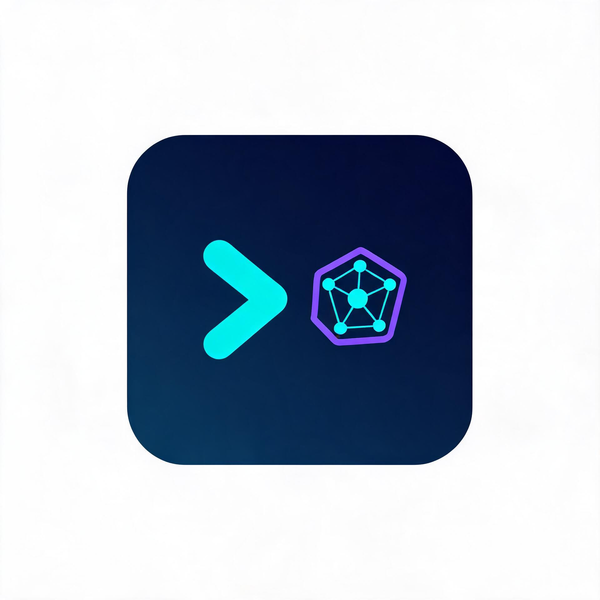

<p align="center">
  
</p>

<h1 align="center">mini-codex</h1>

<p align="center">
  一个独立开发的、轻量级的 AI 结对编程智能体（命令行 CLI）。
</p>

<p align="center">
  
  
  
</p>

> **独立开发声明**：本项目为完全独立开发的软件，从零实现，不隶属于任何其他项目或组织。它借鉴了业界通用的 AI Agent 设计模式（策略模式 + 注册表模式），构建了一个可运行、可扩展、可用于教学的轻量级 AI 结对编程 CLI。

`mini-codex` 由大语言模型（Claude、Qwen、DeepSeek、Kimi 等）驱动，在终端中提供流畅的结对编程体验：读取文件、编写代码、执行命令，并通过自动化的「思考 → 调用工具 → 观察结果 → 再思考」循环来完成任务。

## 核心特性

- **多模型 Provider**：统一的 `LLMProvider` 抽象层，一套代码同时支持 OpenAI 兼容接口（Qwen / DeepSeek / Kimi / GLM 等）与 Anthropic 官方接口（Claude，可选安装）。
- **Agent 循环闭环**：自动的 ReAct 风格循环，模型可自主连续调用多个工具直至给出最终答案（内置 30 轮上限防止死循环）。
- **Tool Use（工具调用）**：内置 `Bash`（执行命令）、`FileRead`（读文件）、`FileWrite`（写文件）、`AddMemory`（写入持久记忆）、`GitStatus`（查询 git 状态）、`AgentTool`（派生子代理）、`MCPTool`（远程插件）。
- **三层安全防线**：破坏性命令拦截（`rm -rf /`、`mkfs`、`dd` 等）、子命令注入拦截（`$(...)`、反引号）、白名单沙盒判定。
- **记忆系统**：`.ai_memory` 文件级持久化记忆，自动注入 System Prompt，并带防 Token 爆炸的截断机制。
- **MCP 插件**：通过 stdio 子进程透明代理，将工具调用转发至独立的 MCP Server 进程。
- **子代理（Agent 分身术）**：支持 `git worktree` 沙箱隔离与后台异步执行。
- **终端 UI**：基于 `rich` 的 ANSI 渲染与流式打字机输出，支持思维链（CoT）实时展示。
- **趣味彩蛋**：`/buddy` 电子宠物（Mulberry32 伪随机生成）。

## 架构图解

```
                    ┌─────────────────────────────┐
                    │        CLI 入口 (cli/main)    │
                    │  参数解析 / 斜杠命令 / 主循环   │
                    └──────────────┬──────────────┘
                                   │ 构建 Provider / Agent
                    ┌──────────────▼──────────────┐
                    │       Agent (core/agent)     │
                    │  协调者：核心循环 + 工具派发    │
                    └───────┬──────────────┬───────┘
                            │              │
              ┌─────────────▼─────┐   ┌────▼──────────────────┐
              │ LLMProvider(抽象) │   │  ToolRegistry(注册表)   │
              │  ├ OpenAIProvider │   │  ├ Bash / FileRead ... │
              │  └ Anthropic...   │   │  ├ GitStatus/Agent     │
              └─────────┬─────────┘   │  └ MCP / AddMemory     │
                        │             └───────────┬───────────┘
           ┌────────────▼───────────┐             │
           │ 云端大模型 API           │    ┌────────▼────────┐
           │ (OpenAI/Anthropic/...) │    │ security 安全检查 │
           └────────────────────────┘    └─────────────────┘
```

**数据流（一次 `agent.chat()`）**：

1. `cli.main_loop` 读取用户输入，非斜杠命令则调用 `agent.chat(user_input)`。
2. `Agent.chat` 调用 `provider.send_message()`，把 `user` 消息追加进上下文并发起流式请求。
3. Provider 返回 `{"text": ..., "toolCalls": [...]}`。
4. 若含 `toolCalls`，`Agent.handle_tool_calls` 遍历，通过 `registry.get_tool(name)` 查找并执行工具。
5. 执行结果回传 `provider.send_tool_results()`，模型继续思考，循环直至无工具调用或达到上限。

## 安装

### 方式一：pipx 安装（推荐）

pipx 会为 CLI 工具创建独立隔离环境，并把命令装到全局，一次安装随处可跑。

```bash
pip install pipx
pipx ensurepath
pipx install .
mini-codex
```

> 更新代码后重新安装：`pipx install --force .`（或 `pipx reinstall mini-codex`）。
> 运行时读取 `~/.mini-codex/config.json` 与系统环境变量（`OPENAI_API_KEY`），与启动目录无关。

### 方式二：源码构建（开发用）

```bash
git clone https://github.com/wjb412530/mini-codex.git
cd mini-codex
python -m venv venv

# Windows（PowerShell / cmd）
venv\Scripts\activate
# macOS / Linux
source venv/bin/activate

pip install -e .
mini-codex
```

### 方式三：免激活直接运行

Windows 下无需 `activate`，直接用 venv 内的入口启动：

```cmd
cd mini-codex
venv\Scripts\mini-codex.exe
```

以模块方式运行（注意主包没有 `__main__.py`，请用 `mini_codex.main`）：

```cmd
venv\Scripts\python.exe -m mini_codex.main
```

> 要求 Python >= 3.9。`pip install -e .` 会安装 OpenAI 兼容协议所需依赖（不含 `anthropic`）。如需 Claude，请额外执行 `pip install -e ".[anthropic]"`；如需运行测试，请执行 `pip install -e ".[dev]"`。

## 启动

> ⚠️ 目录名与命令都叫 **`mini-codex`**（带连字符）。通过 pipx / 源码构建启动前，请确保已完成安装；使用源码方式时需先 `cd` 到项目目录，否则会报「系统找不到指定的路径」或「'mini-codex' 不是内部或外部命令」。

```cmd
cd C:\Users\86452\Desktop\mini-codex
venv\Scripts\activate
mini-codex
```

首次启动会自动读取 `.env` 或 `~/.mini-codex/config.json`；若未检测到 API Key 则进入交互式配置向导。

## 配置

在工作目录或用户主目录下创建 `.env`（或用 `~/.mini-codex/config.json`）：

```env
# OpenAI 兼容（Qwen / DeepSeek 等，国内大模型推荐此方式）
PROVIDER=openai
OPENAI_API_KEY=sk-xxx
OPENAI_BASE_URL=https://dashscope.aliyuncs.com/compatible-mode/v1   # 通义千问 Qwen
MODEL_NAME=qwen-plus

# 是否展示思维链（思考过程）。设为 false 可关闭思考过程、输出更干净
SHOW_THINKING=true

# 或 Anthropic（需先 pip install -e ".[anthropic]"）
# PROVIDER=anthropic
# ANTHROPIC_API_KEY=sk-ant-xxx
# MODEL_NAME=claude-sonnet-4-20250514
```

首次运行未配置 Key 时会进入交互式配置向导，引导你完成设置。

## 使用

进入 `>` 提示符后，直接用自然语言下指令即可，例如：

- 「读取 src/main.py 文件，并为所有函数添加注释。」
- 「运行测试用例，并修复所有报错的代码。」
- 「列出当前目录下有哪些文件？」

### 命令行参数

| 参数 | 说明 |
|------|------|
| `--provider` | LLM 提供商（openai / anthropic，默认读配置） |
| `--model` | 模型名称 |
| `--base-url` | OpenAI 兼容接口的 base URL |
| `--verbose` | 显示详细调试日志 |

### 交互命令

| 命令 | 作用 |
|------|------|
| `/help` | 查看帮助 |
| `/clear` | 清空对话历史 |
| `/buddy` | 召唤电子宠物 |
| `/exit` / `/quit` | 退出 |

## 内置工具

| 工具 | 名称 | 说明 |
|------|------|------|
| `BashTool` | `Bash` | 执行 shell 命令（内置三层安全拦截） |
| `FileReadTool` | `FileRead` | 读取文件内容（支持行数截断） |
| `FileWriteTool` | `FileWrite` | 写入 / 追加文件（支持防覆盖） |
| `AddMemoryTool` | `AddMemory` | 将重要规则写入 `.ai_memory` |
| `GitStatusTool` | `GitStatus` | 查询代码库 git 状态（只读） |
| `AgentTool` | `AgentTool` | 派生子代理（支持 worktree 隔离 / 后台运行） |
| `MCPTool` | 动态 | 通过 stdio 代理调用远程 MCP 插件 |

## MCP 插件接入

通过环境变量 `MINI_CODEX_MCP_SERVERS`（JSON 数组）声明 MCP 服务器，启动时会自动注册为工具：

```bash
export MINI_CODEX_MCP_SERVERS='[{"name":"fetch","description":"发起网络请求","command":"python -m my_mcp_server","input_schema":{"type":"object","properties":{"url":{"type":"string"}},"required":["url"]}}]'
```

## 运行测试

```bash
cd mini-codex
pip install -e ".[dev]"   # 首次需要：安装测试依赖（pytest / pytest-asyncio）
pytest                    # 12 个用例，全异步（asyncio_mode=auto）
```

## 项目结构

```text
mini-codex/
├── pyproject.toml               # 打包配置，定义 console_script: mini-codex
├── src/mini_codex/
│   ├── cli/                     # 命令行入口与主循环
│   ├── config/                  # 配置管理（环境变量 > config.json > 默认值）
│   ├── core/                    # Agent 循环、记忆系统
│   │   └── providers/           # OpenAI（必装）/ Anthropic（可选）Provider
│   ├── tools/                   # 工具系统
│   │   └── security/            # 三层安全检查
│   ├── utils/                   # 终端输出
│   └── buddy/                   # 电子宠物彩蛋
└── tests/                       # 单元测试
```

## 技术栈

- `asyncio` — 全异步非阻塞 I/O
- `Pydantic v2` — 工具参数校验与 JSON Schema 生成
- `openai` SDK — OpenAI 兼容协议（默认）；`anthropic` SDK — 可选
- `rich` + `prompt_toolkit` — 终端 UI

## 开源协议

[MIT License](LICENSE)